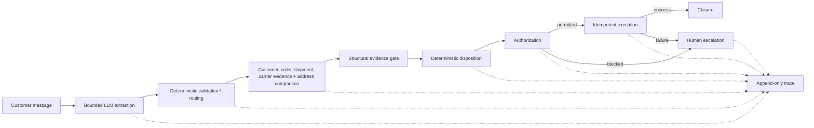

# Delivered-Not-Received Support Agent

## What this is

A synthetic ecommerce support workflow for a customer whose package is marked delivered but cannot be found.

A bounded LLM converts the customer message into a validated schema. Deterministic workflow logic retrieves retailer and carrier evidence, applies a structural evidence gate and disposition rule, checks autonomous authority, and either executes an idempotent refund or escalates safely. Explicit state and append-only tracing make each run inspectable and reconstructable.

Retailer and integration data are synthetic. This is a local lab implementation, not a production deployment.

## What the demo shows

The browser demo is a lightweight trace and evaluation inspector. It presents a customer scenario alongside one end-to-end runtime trace: model call and validation, tools, decisions, authority, execution, state, and expandable technical evidence. It also includes an architecture view, evaluation inspector, and selectable **Demo paths** for:

- Normal autonomous refund
- Order not found
- Carrier evidence unavailable
- Refund exceeding autonomous authority
- Refund execution failure

## Architecture



This is a modular monolith / local lab implementation, not a microservices design. The deterministic path is: customer message → bounded extraction → validation and routing → evidence retrieval → address comparison → structural gate → disposition → authorization → idempotent execution → closure or human escalation → trace.

## AI vs. deterministic

The LLM is used only where natural-language interpretation is needed: turning a customer message into a fixed, validated extraction contract. Deterministic logic owns validation, routing, evidence retrieval, the structural gate and policy, disposition, authorization, execution, state transitions, and tracing.

The model does not decide policy, grant itself authority, or execute a refund.

## Safety and failure handling

- Invalid or ungrounded model output is rejected before it enters the trusted workflow.
- An unknown order fails safely; unavailable carrier evidence does not become invented evidence.
- Amount or currency mismatches and over-limit refunds block autonomous execution.
- An execution failure preserves the selected disposition and routes the open case to human review.
- A stable operation identity and execution registry suppress duplicate consequential actions.

Implementation and regression detail are linked below rather than duplicated here.

## Evaluation

The displayed evidence is deterministic, offline synthetic-fixture replay with deterministic validators and graders; it does not report retained live-provider performance. Live model evaluation runners exist separately. The automated suite uses neither an LLM-as-judge nor a human grader.

- **Extraction behavior:** nine-field contract checks, semantic robustness, and identifier-grounding / hallucination rejection.
- **Workflow correctness:** outcome evaluation is separate from trajectory evaluation, so a successful result cannot conceal an unsafe action sequence.
- **Safety / authorization:** negative controls verify that execution cannot precede required decisions or exceed autonomous authority.
- **Reliability / recovery:** dependency and execution-failure regressions, plus idempotency and duplicate suppression.

The full offline suite currently passes **265 tests** and makes no paid model calls.

## Business case and rollout

The business case is synthetic and assumption-driven. Its value model compares released support capacity, avoided compensation, possible carrier recovery, and operating cost. The rollout is evidence-gated: discovery → shadow → human-reviewed pilot → limited autonomy → controlled expansion.

See [deployment arithmetic](docs/05-deployment-arithmetic.md) and the [production rollout plan](docs/06-production-rollout.md).

## Run locally

From the repository root:

```bash
uv sync
source .venv/bin/activate
```

Offline (scripted extraction; no API key or paid call):

```bash
python -m support_agent.demo_server
```

Live-enabled (explicit opt-in):

```bash
python -m support_agent.demo_server --enable-live
```

Live mode requires `ANTHROPIC_API_KEY` and calls the provider only when **Run case** is selected. Keep the key in an untracked `.env` (copy from `.env.example`) and follow the paid-call approval and cost-reporting requirements in [`AGENTS.md`](../../AGENTS.md). Routine offline tests remain separate:

```bash
python -m unittest discover -s tests
```

## Deep dive

| Topic | Evidence |
| --- | --- |
| Business context and workflow | [business context](docs/01-business-context.md), [current workflow](docs/02-current-workflow.md) |
| System boundaries and design tradeoffs | [system boundaries](docs/03-system-boundaries.md), [decision log](docs/04-decision-log.md) |
| Extraction and model boundary | [`extraction.py`](../../src/support_agent/extraction.py), [`modeling.py`](../../src/support_agent/modeling.py), [`anthropic_adapter.py`](../../src/support_agent/anthropic_adapter.py) |
| Workflow, domain state, and synthetic evidence | [`workflow.py`](../../src/support_agent/workflow.py), [`domain.py`](../../src/support_agent/domain.py), [`synthetic_retailer.py`](../../src/support_agent/synthetic_retailer.py) |
| Idempotent execution and tracing | [`execution.py`](../../src/support_agent/execution.py), [`tracing.py`](../../src/support_agent/tracing.py) |
| Evals and failure regressions | [`extraction_evaluation.py`](../../src/support_agent/extraction_evaluation.py), [`trajectory_evaluation.py`](../../src/support_agent/trajectory_evaluation.py), [`failures.py`](../../src/support_agent/failures.py), [`tests/`](../../tests) |
| Demo entry point | [`demo.py`](../../src/support_agent/demo.py), [`demo_server.py`](../../src/support_agent/demo_server.py) |
| Economics and rollout | [deployment arithmetic](docs/05-deployment-arithmetic.md), [production rollout](docs/06-production-rollout.md) |

## Limitations

- Retailer data, integrations, policies, and cases are synthetic; no real customer data is used.
- State, traces, and the execution registry are local and in memory, with no durable persistence or restart recovery.
- Production authentication, incident operations, infrastructure, and real integrations are not built.
- The live evaluation set is limited; this is not evidence of production performance or realized ROI.
