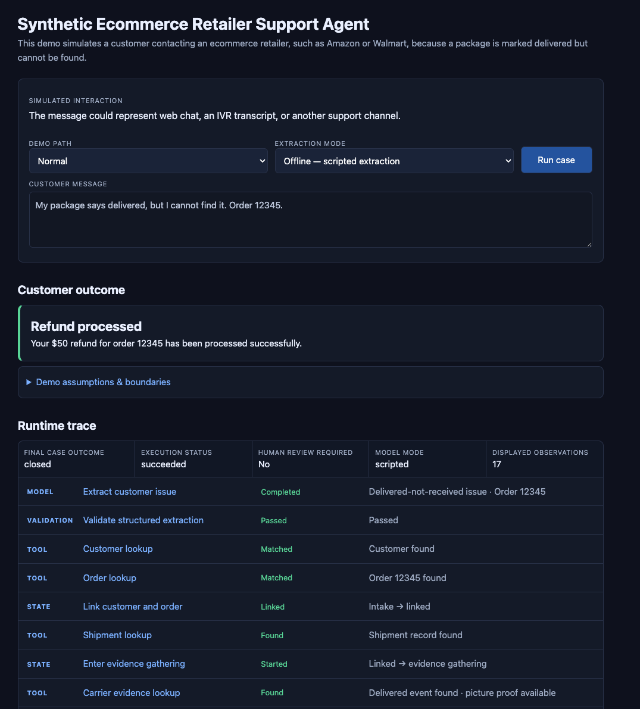
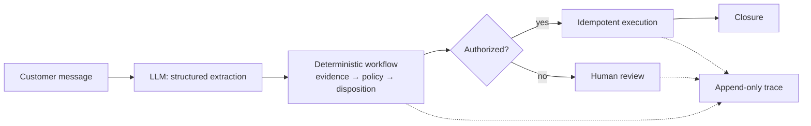

# Delivered-Not-Received Support Agent

A synthetic ecommerce support workflow for customers whose package is marked delivered but cannot be found.

The system uses an LLM for one bounded task: turning the customer message into validated structured data. Deterministic code owns evidence retrieval, policy, authorization, execution, state, and tracing.

**Synthetic data · Local lab implementation · Not a production deployment**

## 🚀 Demo

**[Try the public demo](https://support-agent-demo-maxa.onrender.com)**

The hosted version runs in offline/scripted mode and makes no provider calls. Free hosting may take ~30–60 seconds to wake after inactivity.

The browser demo exposes the customer outcome and the ordered runtime trace behind it.



Demo paths include:

`autonomous refund` · `order not found` · `carrier unavailable` · `over-limit refund` · `execution failure`

## 🧠 System design



The core boundary is deliberate:

- **LLM:** interpret natural language into a fixed, validated contract
- **Deterministic system:** retrieve evidence, apply policy, select disposition, check authority, execute, transition state, and trace

The model does **not** decide policy, grant itself authority, or execute a refund.

A second design choice matters just as much: **the correct resolution and the authority to execute it are separate decisions.** A refund can be appropriate while still requiring human approval.

## 🛡️ Safety and failure handling

The workflow fails closed around consequential actions:

- invalid or ungrounded model output is rejected before entering the trusted workflow
- missing customer, order, or carrier evidence cannot be invented
- currency mismatches and over-limit refunds block autonomous execution
- execution failures preserve the case and route it to human review
- stable operation identity and an execution registry suppress duplicate actions

## Evaluation

**265 offline tests currently pass with no paid model calls.**

The routine suite uses synthetic fixture replay and deterministic validators rather than an LLM-as-judge. It evaluates four separate properties:

- **Extraction:** contract correctness, semantic robustness, and identifier grounding
- **Workflow:** outcome correctness and trajectory correctness
- **Authorization:** execution cannot precede required decisions or exceed configured authority
- **Recovery:** dependency failures, execution failures, idempotency, and duplicate suppression

This distinction matters: a correct final answer does not count as success if the system reached it through an unsafe sequence.

→ [`tests/`](../../tests) · [`extraction_evaluation.py`](../../src/support_agent/extraction_evaluation.py) · [`trajectory_evaluation.py`](../../src/support_agent/trajectory_evaluation.py)

## 📈 Deployment thinking

The project also models how this system would move toward production rather than treating a working demo as sufficient evidence.

**Discovery → shadow mode → human-reviewed pilot → limited autonomy → controlled expansion**

The business case is synthetic and assumption-driven. It models released support capacity, avoided compensation, potential carrier recovery, and operating cost.

→ [Deployment arithmetic](docs/05-deployment-arithmetic.md) · [Production rollout plan](docs/06-production-rollout.md)

## 🔎 Inspect the implementation

| Area | Evidence |
| --- | --- |
| Workflow and business context | [Business context](docs/01-business-context.md) · [Current workflow](docs/02-current-workflow.md) |
| System boundaries and tradeoffs | [System boundaries](docs/03-system-boundaries.md) · [Decision log](docs/04-decision-log.md) |
| Model boundary | [`extraction.py`](../../src/support_agent/extraction.py) · [`modeling.py`](../../src/support_agent/modeling.py) · [`anthropic_adapter.py`](../../src/support_agent/anthropic_adapter.py) |
| Workflow and state | [`workflow.py`](../../src/support_agent/workflow.py) · [`domain.py`](../../src/support_agent/domain.py) |
| Execution and tracing | [`execution.py`](../../src/support_agent/execution.py) · [`tracing.py`](../../src/support_agent/tracing.py) |
| Evals and regressions | [`tests/`](../../tests) · [`failures.py`](../../src/support_agent/failures.py) |

<details>
<summary><strong>Run locally</strong></summary>

From the repository root:

```bash
uv sync
source .venv/bin/activate
```

Run offline with scripted extraction and no API key:

```bash
python -m support_agent.demo_server
```

Run locally with live model extraction:

```bash
python -m support_agent.demo_server --enable-live
```

Live mode requires `ANTHROPIC_API_KEY`.

Run the offline test suite:

```bash
python -m unittest discover -s tests
```

</details>

## ⚠️ Limitations

- Retailer data, integrations, policies, and cases are synthetic.
- State, traces, and the execution registry are local and in memory.
- Production authentication, durable infrastructure, incident operations, and real integrations are not implemented.
- The offline evaluation suite is not evidence of production model performance or realized ROI.
