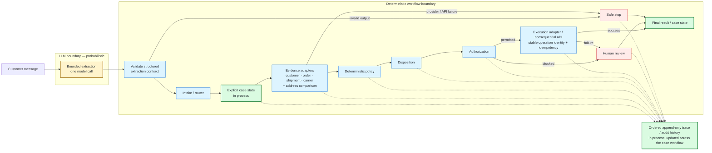

# Delivered-Not-Received Support Agent

This project models a retailer's delivered-not-received support workflow: a bounded LLM task turns
customer language into structured fields, then deterministic code links the case to synthetic
customer, order, shipment, and carrier evidence; applies policy and a controlled disposition;
checks execution authority; and either performs an idempotent consequential action or sends the
case to human review. Explicit state and append-only traces make each decision reconstructable.
The business context and integrations are synthetic, while the evaluation evidence, economic
hypothesis, and gated production rollout plan show how the prototype would be tested and introduced
safely.

## Architecture at a glance



The prototype supplies the evidence and execution interfaces with deterministic synthetic
adapters. The Anthropic adapter is used only for the bounded extraction contract; real retailer,
carrier, support, and refund APIs are production work, not simulated claims of integration.

## What is AI vs. deterministic

| Layer | AI or deterministic | Why |
| --- | --- | --- |
| Customer-message extraction | LLM | Interpret natural language into a fixed, validated schema |
| Intake and routing | Deterministic | Keep workflow entry and required-state checks predictable |
| Evidence retrieval | Deterministic adapters | Look up source-of-truth customer, order, shipment, and carrier facts |
| Policy | Deterministic | Apply explicit business rules to retrieved evidence |
| Disposition | Deterministic | Select only a controlled resolution |
| Authorization | Deterministic | Enforce the consequential authority boundary by action, amount, and currency |
| Execution | Deterministic tool/API call | Make side effects explicit and idempotent |
| State and tracing | Deterministic | Preserve transitions, tool metadata, outcomes, and safe stops for reconstruction |

The model proposes structure; it does not decide policy, grant itself authority, or execute a
refund. Parsed model output must pass schema, consistency, and grounding checks before routing.

## End-to-end request path

1. A customer reports that an order marked delivered is missing.
2. The model extracts the issue type and supplied order/tracking identifiers into the nine-field
   extraction contract.
3. The intake router validates the extraction and creates the trusted workflow input.
4. Synthetic adapters retrieve and link customer, order, shipment, carrier, and address evidence.
5. Deterministic policy evaluates evidence, and disposition selects the resolution.
6. Authorization compares the refund action, amount, and currency with the configured authority.
7. Execution uses a stable operation identity; a successful refund updates execution and closure
   state.
8. The trace records ordered state changes and sanitized tool call/return metadata.

## Failure and safety behavior

- A carrier-adapter timeout safe-stops before policy; a valid but missing carrier snapshot routes
  to customer action without execution. Neither path invents evidence.
- A supplied order ID that is not found requests correction, then resumes the same case after one
  corrected identifier.
- Refund execution failure preserves `approve_refund`, records the failed operation, and routes the
  open case to human review.
- A repeated successful operation is suppressed and its prior result is reused instead of calling
  the execution adapter twice.
- Missing refund-authority inputs are rejected at configuration; amount or currency mismatches are
  blocked before an execution operation is created.
- A $150 approved refund under a $100 autonomous limit keeps the disposition but routes to human
  review with execution `not_started`.

Timeout, rate-limit, unavailable-service, malformed-result, retry, and execution-budget paths also
have deterministic failure-injection coverage. These are safe-stop semantics in a local prototype,
not a claim of production recovery infrastructure.

## Evaluation evidence

- **Extraction contract:** exact schema, type, internal-consistency, identifier-grounding, malformed
  response, and clarification behavior are tested independently.
- **Hard extraction cases:** difficult syntax, multiple numbers, unsupported issues, invented IDs,
  wrong types, and contradictory clarification fields probe brittle model behavior.
- **Semantic robustness:** meaning-preserving wording, fact-order, irrelevant-detail, and verbosity
  variants are graded by contract semantics rather than one exact phrase.
- **Workflow evaluation:** final-outcome correctness is separate from trajectory correctness, so a
  correct refund cannot conceal execution before disposition.
- **Negative controls:** deliberately bad traces prove the evaluator detects execution before
  disposition and execution despite insufficient authority.

The ordinary offline suite currently passes **252 tests** and never makes a paid model call. Live
Anthropic evaluations are separate, manually confirmed commands because they cost money and are not
the interview demo path.

## Business and deployment

### Economic hypothesis

The synthetic value model estimates **released support capacity + unnecessary compensation avoided
+ carrier recovery upside - AI/tool/operating cost**. It keeps carrier recovery at $0 until evidence
exists, retains residual review/fallback labor, and treats all current business inputs as synthetic
assumptions rather than realized savings. See
[deployment arithmetic](docs/05-deployment-arithmetic.md).

### Production rollout

Authority expands only with evidence through **discovery -> shadow mode -> human-reviewed pilot ->
limited autonomy -> controlled expansion**. Each gate requires the relevant trajectory,
authorization, recovery, adoption, customer, and business evidence; elapsed time alone never grants
autonomy. See the [production rollout plan](docs/06-production-rollout.md).

## Demo and how to run

From the repository root, install the project into its local environment:

```bash
uv sync
source .venv/bin/activate
```

The browser demo is organized around one customer message, a deterministic customer-facing outcome,
and one readable execution trace. Its expandable evidence exposes the model request/response,
validated extraction, actual synthetic adapter names and payloads, policy and authority inputs,
state changes, latency/retries, and operation identity. The implementation remains split across
`demo.py` (composition/view model), `demo_server.py` and `demo_static/index.html` (localhost UI),
`modeling.py` / `anthropic_adapter.py` (model boundary), `extraction.py` (validation), `workflow.py`
(orchestration/tools), `domain.py` (state), `execution.py` (idempotency), and `tracing.py` (events).

The default mode locks the textarea to the representative fixture and labels extraction as
scripted; synthetic evidence and execution require no API key and make no paid call:

```bash
python -m support_agent.demo_server
```

Live Claude extraction is a separate explicit opt-in. It changes only the extraction client, makes
at most one provider call per run, requires `ANTHROPIC_API_KEY`, and never falls back to scripted
output. Starting it does not itself make a call; pressing **Run case** does and therefore requires
the paid-call approval described in `AGENTS.md`:

```bash
python -m support_agent.demo_server --enable-live
```

### Try the demo

Start the live-enabled server and open the localhost URL it prints:

```bash
python -m support_agent.demo_server --enable-live
```

Live Claude runs require `ANTHROPIC_API_KEY`; select **Offline — scripted extraction** to use the
locked, no-provider-call fixture instead.

| Order ID | Path |
| --- | --- |
| `12345` | Autonomous refund success |
| `24680` | Autonomous refund success with different retailer/carrier data |
| `31415` | Missing carrier evidence; further evidence required |
| `27182` | Refund approved in principle but blocked by autonomous authority limit |
| Unknown ID | Order not found; no refund executed |

Set **Execution mode** to **Inject refund execution failure** with a supported refund-eligible order
to test downstream execution failure. Unknown IDs fail safely and never map to a fabricated record.

Run the offline tests and evaluations with:

```bash
python -m unittest discover -s tests
```

The live Anthropic adapter reads `ANTHROPIC_API_KEY` from the environment. If you later run an
explicitly approved paid evaluation, copy `.env.example` to the untracked `.env`, put the key only
there, and load it into the current shell:

```bash
cp .env.example .env
# Edit .env locally; never commit or paste the key into source, docs, fixtures, logs, or screenshots.
set -a
source .env
set +a
```

Live runners require their explicit confirmation flag and remain outside routine tests. Follow the
repository's paid-call approval and cost-reporting rules before using one.

## Where to look

| Question | Evidence in the repo |
| --- | --- |
| Business problem / current workflow | [`01-business-context.md`](docs/01-business-context.md), [`02-current-workflow.md`](docs/02-current-workflow.md) |
| Architecture / authority boundaries | [`03-system-boundaries.md`](docs/03-system-boundaries.md) |
| Design tradeoffs and repairs | [`04-decision-log.md`](docs/04-decision-log.md) |
| Model adapter | [`anthropic_adapter.py`](../../src/support_agent/anthropic_adapter.py), [`modeling.py`](../../src/support_agent/modeling.py) |
| Extraction contract and validation | [`extraction.py`](../../src/support_agent/extraction.py) |
| Intake, adapters, policy flow, and authorization | [`workflow.py`](../../src/support_agent/workflow.py), [`domain.py`](../../src/support_agent/domain.py) |
| Idempotent execution | [`execution.py`](../../src/support_agent/execution.py) |
| State and traces | [`domain.py`](../../src/support_agent/domain.py), [`tracing.py`](../../src/support_agent/tracing.py) |
| Failure handling and budgets | [`failures.py`](../../src/support_agent/failures.py), [`budgets.py`](../../src/support_agent/budgets.py), [`test_workflow.py`](../../tests/test_workflow.py) |
| Extraction and robustness evals | [`extraction_evaluation.py`](../../src/support_agent/extraction_evaluation.py), [`test_extraction_evaluation.py`](../../tests/test_extraction_evaluation.py), [`test_semantic_robustness_evaluation.py`](../../tests/test_semantic_robustness_evaluation.py) |
| Outcome / trajectory evals | [`trajectory_evaluation.py`](../../src/support_agent/trajectory_evaluation.py), [`test_trajectory_evaluation.py`](../../tests/test_trajectory_evaluation.py) |
| Demo entry point | [`demo_server.py`](../../src/support_agent/demo_server.py), [`demo.py`](../../src/support_agent/demo.py) |
| Economic model | [`05-deployment-arithmetic.md`](docs/05-deployment-arithmetic.md) |
| Safe rollout | [`06-production-rollout.md`](docs/06-production-rollout.md) |

## Limitations

- The retailer, policies, cases, and integrations are synthetic; no real customer data is used.
- Adapter calls and execution are local synthetic stand-ins, not real retailer or carrier APIs.
- Case state, traces, and the execution registry are in process, with no durable persistence,
  checkpointing, or restart recovery.
- The live extraction evaluation set is intentionally small and cannot establish production model
  performance.
- Production identity, secrets, observability, incident operations, infrastructure, and real
  integrations are described in the rollout plan, not built.
