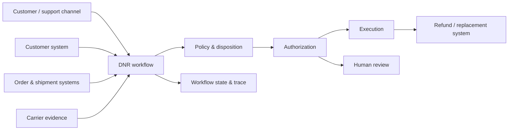

# System Boundaries

**Technical design reference · Synthetic workflow**

This document explains the boundaries and core deterministic design of the delivered-not-received support workflow.

It began as the pre-implementation domain model. The current prototype now implements many of these patterns in code, including explicit workflow state, guarded transitions, deterministic policy and authorization, idempotent execution, and append-only tracing.

→ [`domain.py`](../../../src/support_agent/domain.py) · [`workflow.py`](../../../src/support_agent/workflow.py) · [`execution.py`](../../../src/support_agent/execution.py) · [`tracing.py`](../../../src/support_agent/tracing.py)

## Core design decisions

1. **External systems remain sources of truth.**  
   The workflow retrieves customer, order, shipment, and carrier evidence but does not pretend to own those records.

2. **Decision and execution are separate.**  
   `disposition = approve_refund` means a refund is the selected resolution. It does not mean the refund happened.

3. **Workflow state is explicit.**  
   Lifecycle, disposition, execution, and external follow-up are modeled separately rather than collapsed into one overloaded status.

4. **Consequential actions fail closed.**  
   Missing evidence, unresolved policy, authorization blocks, or execution uncertainty cannot silently become approval or success.

5. **Retries identify the intended operation.**  
   Retries of the same refund reuse a stable operation identity so the system can suppress duplicate real-world effects.

## System boundary



### Inside the workflow

- case lifecycle and explicit state
- references to external records
- evidence snapshots
- deterministic policy inputs and results
- selected disposition
- authorization checks
- human-review requests and decisions
- execution attempts
- external follow-up status
- append-only trace events

### Outside the workflow

- customer/account records
- order and shipment records
- carrier tracking systems
- refund/replacement infrastructure
- carrier claim systems
- support-channel infrastructure

Those systems remain authoritative for their own records and execution results.

## State model

The workflow separates four concepts that are easy to collapse incorrectly:

| Field | What it answers |
| --- | --- |
| `case_status` | Where is the case in the workflow? |
| `disposition` | What resolution was selected? |
| `execution_status` | Was the selected action actually carried out? |
| `follow_up_status` | Is the case waiting on an external process? |

This makes important distinctions representable.

For example:

```text
disposition = approve_refund
execution_status = not_started
```

means the refund has been approved but **has not happened yet**.

Likewise:

```text
disposition = open_carrier_inquiry
execution_status = succeeded
follow_up_status = pending
```

means the carrier inquiry was successfully filed, but the external result has not arrived.

## Core lifecycle

The candidate lifecycle is:

```text
intake
→ linked
→ evidence_gathering
→ policy_review
→ disposition_selection
→ executing
→ closed
```

Cases may branch into:

- `awaiting_customer_action`
- `human_review`
- `awaiting_external_follow_up`

The workflow does not silently advance a case when required evidence, policy, or authority is missing.

## Transition invariants

A small set of invariants carries most of the safety value.

### 1. Approval is not execution

A refund or replacement cannot close the case until execution succeeds.

```text
approve_refund + not_started ≠ closed
approve_refund + in_progress ≠ closed
approve_refund + succeeded → closed
```

### 2. Invalid transitions do not mutate case state

If code attempts an invalid transition, the guard rejects it, preserves the existing state, records the event, and raises an operational integrity signal.

A malformed transition is a system problem. It should not masquerade as a legitimate business escalation.

### 3. Missing policy does not become permission

If a required business rule is unresolved, the system does not infer a favorable result. It routes to human review or abstains from the action.

### 4. Failed execution preserves the decision

If a refund was correctly approved but the execution call fails:

```text
disposition = approve_refund
execution_status = failed
case_status = human_review
```

The system does not pretend the refund succeeded, and it does not erase the fact that refund remains the selected disposition.

### 5. External follow-up is distinct from execution

Successfully filing a carrier claim is not the same as receiving the claim result.

The workflow records both separately.

## Deterministic policy boundary

The model may use inputs such as:

- delivery status and timestamp
- address-match result
- picture-proof availability
- customer self-check completion
- order value
- item category
- prior-case information
- documentation availability
- carrier-claim eligibility
- execution permissions

Business policy remains deterministic once defined.

Examples of policy questions that belong outside the model:

- Is this amount within autonomous refund authority?
- Is a replacement permitted for this item category?
- Is the evidence too stale to rely on?
- When should an unanswered customer request expire?
- When does an external follow-up require review?
- Which signals require risk or fraud review?

When those rules are not known, the safe default is to **stop, request information, or route to a person** rather than invent policy.

## Disposition vs. authorization

The workflow deliberately separates:

```text
policy → disposition → authorization → execution
```

A case may have the correct disposition but still lack permission for autonomous execution.

Example:

```text
selected refund = $150
autonomous authority limit = $100
```

The system can preserve:

```text
disposition = approve_refund
```

while routing the case to human review because the execution authority is not satisfied.

This separation prevents business correctness from being confused with system permission.

## Human review

Human review is used when the system reaches a boundary that requires judgment or authority rather than more model reasoning.

Representative triggers include:

- customer/order linkage is ambiguous
- evidence is contradictory
- a case exceeds the configured authority envelope
- required policy is unresolved
- duplicate compensation is suspected
- a risk or fraud rule triggers
- an execution attempt fails
- an external carrier result requires interpretation
- a follow-up deadline requires a business decision

No reviewer response means the case remains pending. There is no silent auto-approval.

## Failure semantics

Different failures are represented separately because they require different responses.

| Failure | Representation | Behavior |
| --- | --- | --- |
| Business denial | `disposition = deny` | Close with an explicit business decision |
| Missing or ambiguous linkage | retrieval / match failure | Stop progression or route to review |
| Dependency unavailable | retrieval or tool failure | Preserve case state; do not fabricate evidence |
| Unresolved policy | explicit unresolved-policy result | Route to review / abstain |
| Execution failure | `execution_status = failed` | Preserve disposition and route to review |
| Pending human decision | `case_status = human_review` | Wait |
| Pending external process | `follow_up_status = pending` | Wait or review based on policy |
| Invalid transition | system-integrity failure | Reject mutation and alert |
| Duplicate retry risk | execution identity conflict | Suppress duplicate effect |

These categories should not collapse into a generic `"failed"` state.

## Idempotent execution

Consequential actions need a stable identity.

Each intended external business operation receives an `operation_id` and a stable idempotency key.

Retries of the **same intended operation** reuse that identity.

A retry must not create a second refund if the first operation already succeeded.

A genuinely distinct later action receives a new operation identity.

For example:

```text
CASE-0001-refund-SHIP-7788-1
```

might identify the first intended refund for one shipment.

A separate refund for another shipment should use a different operation identity rather than masquerading as a retry.

## Evidence and records

The workflow stores or references only what it needs to make and reconstruct decisions.

Conceptually, the case includes:

- customer and order references
- shipment references
- customer-reported information
- timestamped evidence snapshots
- policy-evaluation results
- human-review records
- execution attempts
- external follow-up state
- append-only trace events

For external systems, four things remain distinct:

1. the external source-of-truth record
2. the workflow's reference or snapshot
3. when retrieval occurred
4. whether retrieval succeeded

That distinction matters when evidence can be missing, stale, contradictory, or unavailable.

## Worked example

A synthetic case illustrates the mechanics:

```text
Customer reports:
order marked delivered, package missing

intake
→ linked
→ evidence_gathering
→ policy_review
```

Carrier evidence confirms delivery, and the customer has already completed the expected self-check.

The system determines that a refund is the appropriate disposition, but the amount exceeds autonomous authority.

```text
disposition = approve_refund
case_status = human_review
```

A reviewer approves execution.

```text
case_status = executing
execution_status = not_started
```

The refund call succeeds with a stable operation identity.

```text
execution_status = succeeded
case_status = closed
```

The important point is not the synthetic refund decision. It is the separation between **evidence, disposition, authority, execution, and final state**.

## Production boundary

The current lab design does not establish production readiness.

A production implementation would additionally require:

- durable persistence and checkpointing
- restart and unknown-result recovery
- real retailer, order, shipment, carrier, and execution integrations
- dedicated service identity and least-privilege credentials
- managed secrets and approved PII handling
- production monitoring and alerting
- formal incident ownership and rollback procedures
- customer-specific policy and authority definitions
- measured operating thresholds rather than synthetic defaults

These are requirements, not implemented capabilities.

## Data boundary

Repository artifacts use synthetic data only.

A real version of this workflow would process sensitive commerce and support data, potentially including customer identifiers, addresses, order and shipment information, support messages, prior-case history, and refund activity.

Real customer data should not appear in tracked repository documentation, fixtures, prompts, traces, logs, screenshots, or evaluation datasets without explicit authorization and appropriate governance.

## What is reusable

Patterns that appear reusable beyond this workflow:

- explicit state instead of hidden workflow memory
- source-of-truth boundaries around external systems
- policy → disposition → authorization → execution
- idempotent consequential actions
- safe-stop behavior when evidence or policy is missing
- separate outcome and trajectory evaluation
- append-only traces for reconstruction
- human review at authority and uncertainty boundaries

Domain-specific refund rules, DNR states, carrier logic, and retailer policy remain domain-specific until another project proves genuine reuse.
